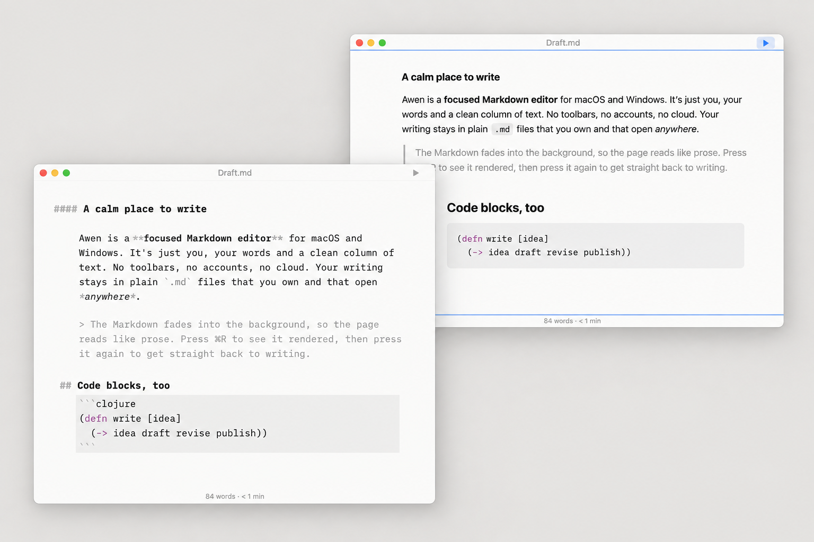
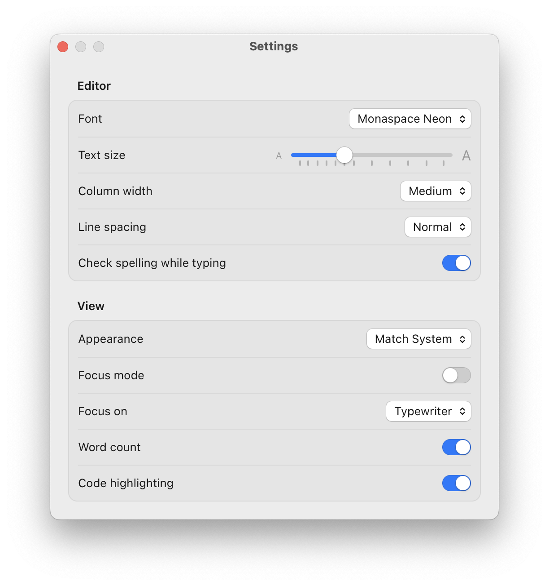
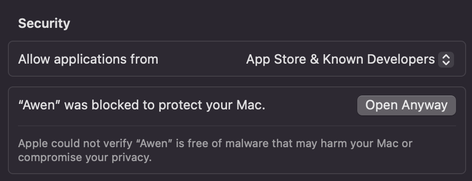

# Awen

**A calm place to write.** Awen is a focused Markdown editor for macOS, with Windows coming soon. It's just you, your words and a clean column of text. There are no toolbars full of buttons, no accounts and no cloud lock-in. Your writing stays in plain `.md` files that you own and that open anywhere.



---

## Why Awen

- **Distraction-free by design.** Text sits in a centered column about 66 characters wide, set in GitHub's Monaspace Neon typeface (or Argon, Radon or the system monospace, in Settings). Markdown marks like `#` and `*` fade into the background, and headings hang into the margin, so the page reads like prose and not like code.
- **Focus on the words you're writing.** Focus mode dims everything but the sentence or paragraph you're in, or keeps your line centered on screen like a typewriter. One keystroke turns it on and off.
- **Plain files, no lock-in.** Awen opens and saves ordinary Markdown files. It even keeps each file's original line endings, so saving never rewrites a file you didn't change.
- **Never lose your work.** Awen asks before closing a document with unsaved changes, including when you quit, log out or restart.
- **Native on every platform.** Awen uses real system menus, your system accent color, light and dark mode, and your platform's keyboard shortcuts.

## Features

### Focus
Press **⌘D** / **Ctrl+D** to turn on Focus Mode, and choose what it focuses on in **View → Focus On**:
- **Sentence.** Everything but the sentence you're writing fades back, so you work one thought at a time.
- **Paragraph.** The paragraph you're in stays bright and the rest dims, which is good for shaping a whole idea.
- **Typewriter.** The line you're typing stays in the middle of the window, so your eyes stay in one place while the text moves past. Nothing is dimmed.

Awen remembers your choice between launches, and you can also set it in Settings.

### Writing
- **Clean Markdown editing.** Syntax is dimmed rather than hidden, so you always know what you've typed.
- **New to Markdown? Use the Format menu.** Select some text and choose Bold, Italic, a heading, a list, a quote, a link and more. Awen adds the Markdown for you, so you learn the syntax by seeing it appear. Choose a style again to take it off. The shortcuts are the ones you already know from word processors, like ⌘B / Ctrl+B for bold, and Clear Styles strips the formatting from a selection.
- **Spell checking that stays put.** Your system's spell checker underlines mistakes, and the underlines stay until you fix them. Right-click a word for suggestions, Learn Spelling or Ignore.
- **Find and replace.** A find bar styled like your OS, with the standard shortcuts.
- **Word count and reading time.** Shown in a quiet footer that switches to the selection's count when you select text. You can hide it from the View menu.
- **Code-friendly.** Fenced code blocks can get light, muted syntax highlighting in the editor if you like.

### Preview and publishing
- **One-keystroke preview.** Press **⌘R** / **Ctrl+R** (or click ▷ in the title bar) to see your document rendered, and press it again to go back to where you were. Links open in your browser, and images next to your document show inline.
- **Tick off tasks.** Click `- [ ]` checkboxes in the preview to tick them, and the change is made in your Markdown.
- **Export to PDF.** Get a properly paginated PDF with clean paper typography, without going through the print dialog.
- **Export to HTML.** Get a single self-contained file with the styles and fonts built in, ready to share or publish. It follows the reader's light or dark mode.
- **Print.** Prints black on white, whatever your theme.

### Feels at home
- **One document per window**, with Open Recent, the Dock menu (macOS) and Jump Lists (Windows).
- **Opens `.md` files from Finder or Explorer.** Double-click a file, or use Open With.
- **Rename, tag and move from the title bar** (macOS). Click the document's name, just like in Apple's own apps. You can also lock a document to protect it from accidental edits.
- **Automatic updates.** Awen tells you when a new version is out and installs it for you, after asking about any unsaved changes. See [Staying up to date](#staying-up-to-date).
- **Settings that follow you.** Change the text size, column width (Narrow, Medium or Wide), line spacing and theme (Match System, Light or Dark). Changes apply live in every window and are remembered between launches.



---

## Download and install

Download the latest version for your system from this repository's **Releases** page.

### macOS
1. Download `Awen_<version>_aarch64.dmg` (Apple silicon) or `Awen_<version>_x64.dmg` (Intel).
2. Open the `.dmg` and drag **Awen** into your **Applications** folder.
3. Eject the disk image, then open Awen from Applications or Launchpad.

> **First launch:** Awen isn't notarized by Apple yet, so macOS blocks it the first time. You only need to do this once.
>
> **macOS 15 (Sequoia) and later:**
> 1. Open Awen. When macOS says it can't verify Awen, click **Done**.
> 2. Within the hour, go to **System Settings → Privacy & Security**, scroll down to **Security**, and click **Open Anyway** next to the message about Awen. Enter your password.
>
>    
>
> 3. Open Awen again and click **Open Anyway**.
>
> **macOS 14 and earlier:** right-click (or Control-click) Awen in Applications, choose **Open**, then click **Open** again.
>
> If there's no **Open Anyway** button, or macOS says Awen "is damaged", run this in Terminal, then open Awen again:
> `xattr -dr com.apple.quarantine /Applications/Awen.app`

### Staying up to date

Awen 0.3.0 and later update themselves. You only install from a `.dmg` once.

1. When Awen starts, it quietly checks for a new version. To check yourself at any time, choose **Awen → Check for Updates…**.
2. If there's a new version, Awen asks whether to install it. Choose **Install and Relaunch**, or **Later** to be asked again next time you open Awen.
3. Awen downloads the update, then closes its windows. If a document has unsaved changes, you're asked to save it first, just as when you quit. Choose **Cancel** to keep working, and the update waits for another time.
4. Awen installs the new version and opens again. There's no **Open Anyway** step this time.

To stop the check at launch, turn off **Automatically check for updates** in **Settings → Updates**. **Check for Updates…** still works.

> **On Awen 0.2.0 or earlier?** Those versions can't update themselves. Download the latest `.dmg` and install it over the old copy, following the steps above. Updates are automatic from then on.

### Windows

Coming soon. Awen builds on Windows, but it doesn't feel native enough there yet, so there's no Windows download for now. If you'd like to help get it ready, see [Contributing](#contributing).

### Keyboard shortcuts

| Action | macOS | Windows |
| --- | --- | --- |
| New / Open / Save | ⌘N / ⌘O / ⌘S | Ctrl+N / Ctrl+O / Ctrl+S |
| Toggle preview | ⌘R | Ctrl+R |
| Focus mode | ⌘D | Ctrl+D |
| Find / Replace | ⌘F / ⌥⌘F | Ctrl+F / Ctrl+H |
| Find next / previous | ⌘G / ⇧⌘G | F3 / Shift+F3 |
| Bold / Italic | ⌘B / ⌘I | Ctrl+B / Ctrl+I |
| Heading 1–6 | ⌘1–⌘6 | Ctrl+1–Ctrl+6 |
| Blockquote | ⌘> | Ctrl+Shift+. |
| Code / Code block | ⌘J / ⇧⌘J | Ctrl+J / Ctrl+Shift+J |
| Add link | ⌘K | Ctrl+K |
| Export… | ⇧⌘E | Ctrl+Shift+E |
| Print | ⌘P | Ctrl+P |
| Bigger / Smaller / Actual Size | ⌘+ / ⌘− / ⌘0 | Ctrl++ / Ctrl+− / Ctrl+0 |
| Settings | ⌘, | Ctrl+, |

---

## Development

### Architecture

Awen is a [Tauri 2](https://tauri.app) app. A small Rust backend hosts a web frontend in the system's own web view (WKWebView on macOS, WebView2 on Windows), so the app stays small and fast.

| Layer | Technology | Where |
| --- | --- | --- |
| Shell, menus, windows, native dialogs | Rust, Tauri 2, `objc2` (macOS), `windows` / `webview2-com` (Windows) | `src-tauri/` |
| UI | SvelteKit (static SPA) with Svelte 5 runes and TypeScript | `src/routes/`, `src/lib/` |
| Editor | CodeMirror 6 with Lezer Markdown parsing | `src/lib/editor/` |
| Preview and export | markdown-it (`html: false`), with Lezer-based code highlighting | `src/lib/preview/`, `src/lib/export/` |
| Styling | Tailwind CSS v4 over CSS tokens, with a token file per OS | `src/styles/` |
| UI components | Bits UI (headless), themed per OS | `src/lib/ui/` |

How it fits together:
- **Native menus drive the app.** Rust builds the menu bar and forwards each menu item's id to the focused window. The page then dispatches it through an `actions` map.
- **One document per window.** Rust keeps track of which file each window shows. It also handles opening files from Finder or Explorer, Open Recent, and quitting in order so each window can prompt about unsaved changes.
- **Preferences** are stored as JSON in the app data folder and broadcast to every window, so a change applies everywhere at once.
- **Platform-specific parts are native code**: the macOS export sheet and title popover, PDF export, the system spell checker and the accent color.

The detailed design notes live in [`docs/agents/`](docs/agents/):
- [`architecture.md`](docs/agents/architecture.md) explains how the pieces connect.
- [`decisions.md`](docs/agents/decisions.md) records why things are the way they are.
- [`gotchas.md`](docs/agents/gotchas.md) lists traps that have already been hit.

### Prerequisites

- [Node.js](https://nodejs.org) 20 or later, and npm
- [Rust](https://www.rust-lang.org/tools/install) (stable)
- Platform tools for Tauri ([guide](https://tauri.app/start/prerequisites/)): Xcode Command Line Tools on macOS; Microsoft C++ Build Tools and WebView2 on Windows

### Build and run

```sh
npm install
make dev      # run the app with hot reload (npm run tauri dev)
make build    # release bundle: .app + .dmg on macOS, .exe + .msi on Windows
```

Bundles are written to `src-tauri/target/release/bundle/`.

> Opening `.md` files from Finder or Explorer only works in a bundled build (`make build`), not in `make dev`.

### Checks

Run all of these before sending a change. They must be clean:

```sh
npm test                           # Vitest unit tests (src/**/*.test.ts)
npm run check                      # svelte-check: 0 errors, 0 warnings
cd src-tauri && cargo fmt && cargo clippy && cargo test
```

Then try the change in the running app. Native menus, dialogs, rendering and printing can't be unit tested.

GitHub Actions runs the same checks on macOS and Windows for every pull request.

### Releasing

```sh
make release VERSION=0.2.0         # bump the version, test, commit and tag v0.2.0
git push origin HEAD v0.2.0        # builds the macOS installers into a draft GitHub release
```

Check the draft on the Releases page, then publish it.

### Contributing

1. **Pick a story.** [`docs/backlog.md`](docs/backlog.md) lists user stories with their status and acceptance criteria. Find open work with:
   `grep -n "Status: Todo\|Status: In progress\|Status: Needs" docs/backlog.md`.
   Mark the story as in progress, and tick its criteria as you go.
2. **Keep logic testable.** Put new logic in plain TypeScript or Rust modules with unit tests next to them, not in `+page.svelte` or Svelte components.
3. **Follow the house rules.** They're listed in [`AGENTS.md`](AGENTS.md). In particular:
   - A new menu item needs its id in `src-tauri/src/menu.rs` (`FORWARDED`) **and** a handler in the page's `actions` map.
   - Read document text with `documentText()`, never `doc.toString()`.
   - markdown-it stays `html: false`.
   - Style with CSS tokens, not hard-coded colors, so per-OS themes and dark mode keep working.
4. **Update the knowledge base.** If you learn something non-obvious, record it in `docs/agents/` in the same change.
5. **Help with Windows.** Many stories are waiting for verification on a real Windows build (`Needs verification`). Testing them there is one of the most useful contributions right now.

AI coding agents (Claude Code, Codex and others) are welcome. [`AGENTS.md`](AGENTS.md) is written for them as well as for people.

### License

Awen is released under the GNU General Public License, version 3 or (at your option) any later version (GPL-3.0-or-later; see `LICENSE`). The bundled Monaspace fonts are licensed under the SIL Open Font License (see `static/fonts/monaspace/LICENSE`).
